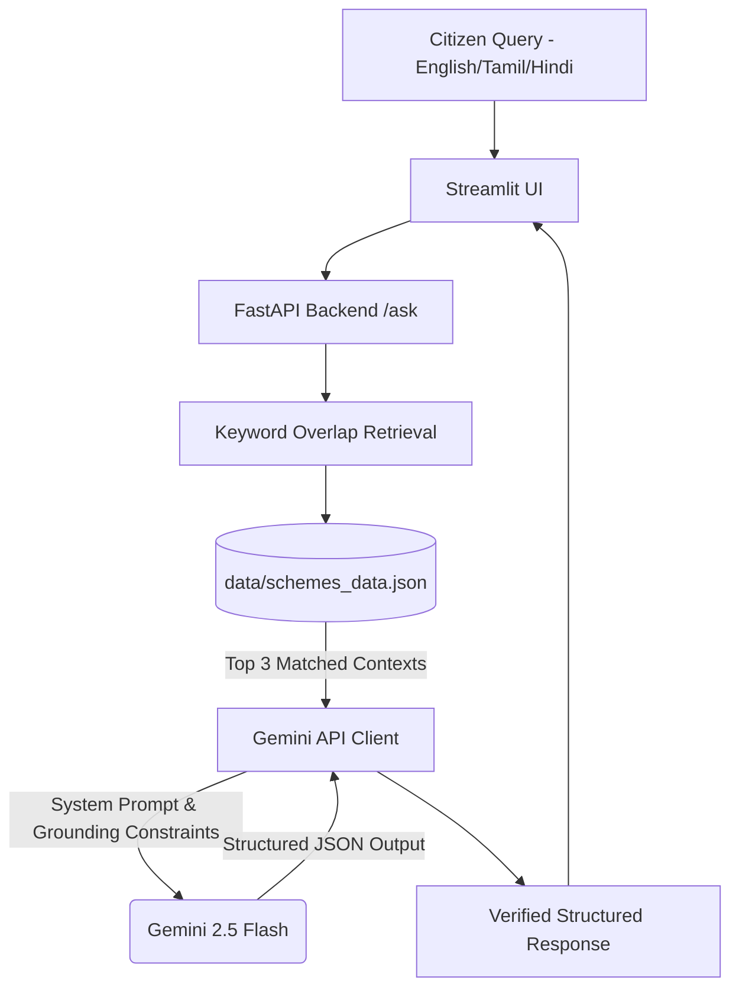

# Building TamilNadu Seva AI: Trustworthy, Grounded Multilingual Assistant for Public Welfare

Welfare schemes can transform lives, but citizens often get lost in complex websites, PDF manuals, and language barriers. To bridge this gap, we built **TamilNadu Seva AI**—a lightweight, highly credible, multilingual AI assistant designed for selected Tamil Nadu state and central government welfare schemes.

This project was built for the **Google Cloud Gen AI Academy APAC Meet the Builders** event.

---

## The Problem
Many citizens, particularly from rural or lower-income backgrounds, face hurdles when searching for scheme information:
1. **Language barrier**: Portals might only support English or formal Tamil, making it hard for everyday citizens.
2. **Hallucination risk**: General-purpose LLMs might hallucinate eligibility requirements or deadlines, leading to citizen frustration or missed opportunities.
3. **Complex navigation**: Details on "how to apply" are scattered across multiple domains.

---

## Why Grounded Multilingual AI?
TamilNadu Seva AI focuses on **trust** and **accuracy**. It implements Retrieval-Augmented Generation (RAG) using a curated local JSON dataset of verified schemes (including *Pudhumai Penn*, *CMCHIS*, and *First Generation Graduation Scholarship*).
The Gemini API (`gemini-2.5-flash`) processes the query alongside the exact official text to generate simple, multilingual, and highly grounded responses.

---

## System Architecture

---

## Google Cloud Tools Used
- **Google GenAI SDK (`google-genai`)**: Interacting with the Gemini Developer API using the latest SDK standards.
- **Gemini 2.5 Flash**: Quick response generation, multi-language support (English, Tamil, Hindi), and high instruction-following capabilities for structured JSON output.
- **Google Cloud Run**: Serverless containers to host both backend API and Streamlit UI independently.

---

## Key Trust Features
1. **"Why this answer?"**: Explanation of the source data matching.
2. **Official Source Links**: Directly displayed next to the answers.
3. **Eligibility & Benefits**: Extracted list formats for easy reading.
4. **Permanent Disclaimers**: Clarifying that information needs official verification.

---

## Future Improvements
- Expanding the local JSON dataset to include all 200+ welfare schemes in Tamil Nadu.
- Integrating speech-to-text and text-to-speech using Google Cloud Speech APIs for lower-literacy citizens.
- Implementing SMS/WhatsApp channels for offline accessibility.
