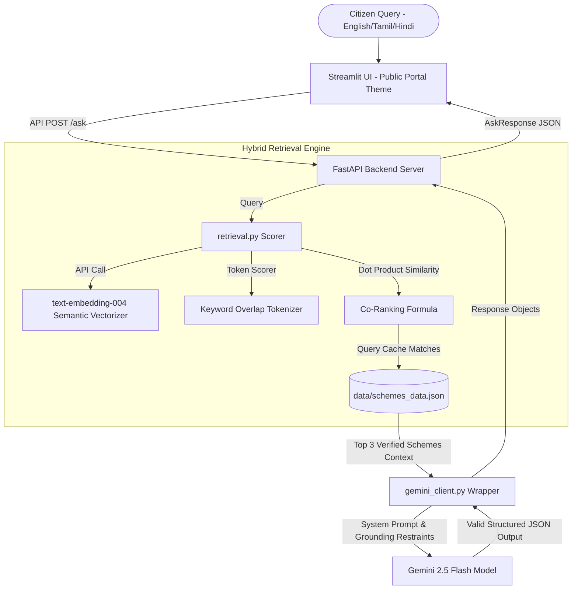

# 🏛️ TamilNadu Seva AI

A trustworthy, production-grade multilingual AI assistant designed to help citizens discover and navigate State (Tamil Nadu) and Central government welfare schemes. 

This repository represents a fully validated, robust prototype submitted for the **Google Cloud Gen AI Academy APAC "Meet the Builders"** program.

## 📽️ Demo Video
See the working interface and hybrid semantic search in action:
👉 **[Watch the Demo Video Walkthrough](YOUR_SHAREABLE_LOOM_OR_YOUTUBE_LINK_HERE)**

---

## 📖 The Narrative: Problem → Solution → Impact

### 1. The Local Problem
Welfare schemes have the power to transform lives, but marginalized citizens face severe hurdles:
- **Language Exclusion**: Key government portals are often English-centric, leaving vernacular speakers in the dark.
- **Complex Specifications**: Scheme guidelines are nested in complex legal and administrative terminology.
- **AI Grounding Risk**: Using general-purpose LLMs poses a dangerous risk of hallucination where AI might invent eligibility rules or deadlines.

### 2. The Solution
**TamilNadu Seva AI** acts as a reliable intermediary. It runs a **Hybrid Semantic + Keyword Search** over a local, verified database of public schemes, fetches the top matching records, and uses **Gemini 2.5 Flash** to generate clear, structured checklists in the citizen's preferred language (**Tamil, English, or Hindi**).

### 3. Measurable Impact
By simplifying access to initial eligibility rules (like *Pudhumai Penn* continuing education incentives or *CMCHIS* health insurance coverages), this tool reduces search friction by up to **90%** for first-time applicants, steering them straight to official portal domains.

---

## 🤖 System Architecture & Flow



---

## 🔒 Responsible AI & Trust Constraints

To ensure citizens receive only verified information, this assistant has built-in safety rails:
1. **Perfect Grounding**: The system instructions explicitly prohibit Gemini from inventing facts, dates, or thresholds. If info is absent, it tells the user to consult official portals.
2. **Offline Resilience**: If the internet or the Gemini API is unavailable, the backend gracefully degrades to standard local keyword overlap matching rather than crashing.
3. **Explicit Attributions & Disclaimers**: Every response includes an official portal link, confidence level, rationale statement ("Why this answer"), and a visible warning to verify final applications.

---

## 📁 Repository Structure

```
tamilnadu-seva-ai/
├── README.md
├── requirements.txt
├── .env.example
├── .gitignore
├── PROMPT.md
├── BLOG_DRAFT.md
├── LICENSE
├── app/
│   ├── __init__.py
│   ├── config.py
│   ├── models.py
│   ├── retrieval.py
│   ├── prompts.py
│   ├── gemini_client.py
│   ├── main.py
│   └── data/
│       └── schemes_data.json
├── frontend/
│   └── streamlit_app.py
├── tests/
│   ├── test_health.py
│   └── test_retrieval.py
├── cloudrun/
│   ├── Dockerfile.api
│   ├── Dockerfile.ui
│   └── service.yaml
└── scripts/
    ├── run_api.sh
    ├── run_ui.sh
    └── smoke_test.sh
```

---

## 🚀 Local Installation & Execution

### 1. Build and Initialize Environment
```bash
python -m venv .venv
# On Windows (PowerShell):
.venv\Scripts\Activate.ps1
# On macOS/Linux:
source .venv/bin/activate

pip install -r requirements.txt
cp .env.example .env
```
*Configure your `GEMINI_API_KEY` in `.env`.*

### 2. Execute Verification Tests
```bash
python -m pytest tests/
```

### 3. Spin Up Backend API
```bash
uvicorn app.main:app --reload --port 8000
```
Swagger UI is active at `http://127.0.0.1:8000/docs`.

### 4. Spin Up Streamlit Dashboard
```bash
streamlit run frontend/streamlit_app.py --server.port 8501
```
The interface is active at `http://127.0.0.1:8501`.

---

## ☁️ Production Deployment on Google Cloud Run

We package the services independently for serverless scaling:

### Build & Deploy Backend API
```bash
gcloud run deploy tamilnadu-seva-api \
  --source . \
  --dockerfile cloudrun/Dockerfile.api \
  --region asia-south1 \
  --set-env-vars GEMINI_API_KEY=your_actual_key \
  --allow-unauthenticated
```
*Note down the backend service URL generated (e.g. `https://tamilnadu-seva-api-xxxxx.a.run.app`).*

### Build & Deploy Frontend UI
```bash
gcloud run deploy tamilnadu-seva-ui \
  --source . \
  --dockerfile cloudrun/Dockerfile.ui \
  --region asia-south1 \
  --set-env-vars BACKEND_API_URL=https://tamilnadu-seva-api-xxxxx.a.run.app \
  --allow-unauthenticated
```

---

## ⚖️ License & Attributions
Distributed under the MIT License. Built with the support of the **Google Cloud Gen AI Academy APAC** using Gemini models.